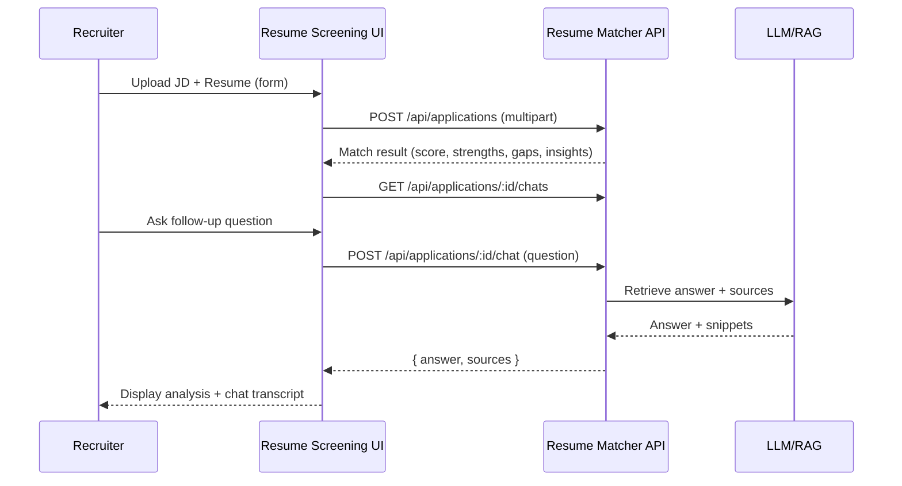
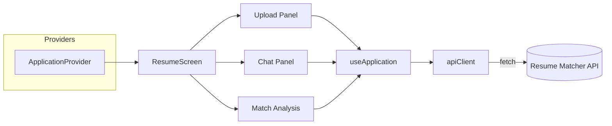

# Resume Screening Tool

Responsive web UI for recruiters to upload resumes + job descriptions, view AI-driven match analysis, and chat with an assistant powered by the Resume Matcher backend.

## Stack
- React 18 + TypeScript, Vite, React Router.
- Tailwind CSS for styling.
- Global state handled via custom context hook (`useApplication`).
- Vitest + Testing Library + MSW for unit/integration tests.

## Quick Start
1. **Install dependencies**
   ```bash
   npm install
   ```
2. **Environment variables**
   Copy `.env.example` → `.env.local` (or `.env`) and provide real values:
   ```bash
   cp .env.example .env.local
   ```
   | Variable | Description |
   | --- | --- |
   | `VITE_API_BASE_URL` | Base URL for the Resume Matcher backend (e.g., `https://api.company.com`) |
   | `VITE_USER_ID` | Auth header `x-user-id` (recruiter external ID) |
   | `VITE_USER_ROLE` | Auth header `x-user-role` (`recruiter` or `candidate`) |
   | `VITE_USE_MOCKS` | `true` to run entirely with mocked data (Storybook/demo) |
3. **Run dev server**
   ```bash
   npm run dev
   ```
   Visit http://localhost:5173.
4. **Run tests**
   ```bash
   npm test
   ```
5. **Build for production**
   ```bash
   npm run build
   ```

## API Reference
All requests include `x-user-id` and `x-user-role` headers (injected by `apiClient`). Responses are JSON. Errors follow `{ "message": string, "statusCode": number }`.

| Endpoint | Method | Body/Input | Response |
| --- | --- | --- | --- |
| `/api/applications` | `POST` (recruiter only) | `multipart/form-data`: `jobKey` (required), `jobTitle`, `candidateUserId`, `resumeFile` (PDF/TXT), `jdFile` (PDF/TXT) | `{ applicationId, jobId?, match: { score, strengths[], gaps[], insights[], breakdown? } }` |
| `/api/applications/:applicationId` | `GET` | Path param `applicationId` | `{ applicationId, jobKey, jobTitle, match, createdAt }` |
| `/api/jobs/:jobKey/applications` | `GET` | Path param `jobKey` | `Application[]` |
| `/api/applications/:applicationId/chat` | `POST` | JSON `{ question: string }` | `{ answer: string, sources?: [{ type, chunkId, excerpt }] }` |
| `/api/applications/:applicationId/chats?limit=&offset=` | `GET` | Query pagination | `{ messages: ChatMessage[], total, limit, offset }` |

### Sample Chat Request
```bash
curl "$VITE_API_BASE_URL/applications/{id}/chat" \
  -H 'x-user-id: demo-user' \
  -H 'x-user-role: recruiter' \
  -H 'Content-Type: application/json' \
  --data '{"question":"Does the candidate have a state university degree?"}'
```

### Response Shape (chat)
```json
{
  "answer": "The candidate has a Bachelor's degree in Computer Science...",
  "sources": [
    { "type": "resume", "chunkId": "0cdf972a...", "excerpt": "ML/JS client..." }
  ]
}
```
The UI displays `answer` in the chat bubble and can optionally surface `sources` elsewhere.

## Architecture Overview

### High-level Flow


### Component/Data Diagram


### State Model
```mermaid
classDiagram
  class ApplicationState {
    current?: Application
    status: idle\|uploading\|loading\|ready\|error
    error?: ApiError
    chats: { loading: boolean; items: ChatMessage[]; total: number; error?: ApiError }
  }
  class ChatMessage {
    id: string
    applicationId: string
    role: 'user' | 'assistant'
    content: string
    createdAt: string
    sources?: ChatSource[]
  }
```

## Directory Structure
```
.
├── docs/
│   └── resume-screening-plan.md  # Detailed planning document
├── src/
│   ├── components/               # Presentational React components
│   ├── hooks/                    # `useApplication` provider + tests
│   ├── screens/                  # Route-level pages
│   ├── services/                 # API client
│   ├── types/                    # Shared TypeScript types
│   ├── utils/mocks.ts            # Demo/mock mode
│   └── tests/                    # MSW server setup
├── README.md
└── package.json
```

## Development Notes
- **Mock/demo mode**: set `VITE_USE_MOCKS=true` to bypass network and rely on `src/utils/mocks.ts` (useful for Storybook/preview environments).
- **Routing**: React Router handles `/` and `/applications/:applicationId`. Deep-linking an application ID will fetch the record and hydrate chat history.
- **File validation**: `FileUploader` restricts to PDF/TXT via MIME type and inline validations.
- **Chat UX**: optimistic user message appended immediately; assistant response replaces with backend payload once resolved.
- **Testing**: API client & hooks have coverage through Vitest + MSW to simulate server responses.

## Future Enhancements
1. Surface source excerpts in a dedicated side panel with filters.
2. Persist chat history beyond current session with pagination controls.
3. Expand resume breakdown when backend exposes structured education/summary fields again.
